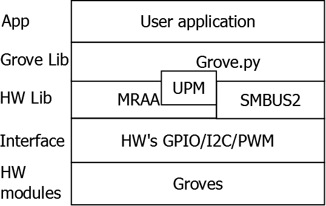

grove.py
========

[](https://travis-ci.org/Seeed-Studio/grove.py)
[](https://pypi.python.org/pypi/grove.py)

Python library for Seeedstudio Grove Devices on Raspberry Pi.

<br><br>
# Archtecture
To operate grove sensors, the grove.py depends many hardware interface libraries such as mraa/smbus2/rpi.gpi/rpi_ws281x. 

<br>



<br><br>
# Installation
For beginner or library user only, please install with online method.<br>
For developer, please install dependencies and then install grove.py with source code.

<br>

### Online install
install/update all dependencies and latest grove.py
```shell
curl -sL https://github.com/Seeed-Studio/grove.py/raw/master/install.sh | sudo bash -s -
```

### Install Dependencies
#### Install MRAA and UPM for Raspberry Pi

- Add repository

```shell
echo "deb https://seeed-studio.github.io/pi_repo/ stretch main" | sudo tee /etc/apt/sources.list.d/seeed.list
```

- Add public GPG key

```shell
curl https://seeed-studio.github.io/pi_repo/public.key | sudo apt-key add -
```
or

```shell
sudo apt-key adv --keyserver keyserver.ubuntu.com --recv-keys BB8F40F3
```

- Install MRAA & UPM

```shell
sudo apt update
# Python2
sudo apt install python-mraa python-upm
# Python3
sudo apt install python3-mraa python3-upm
```

#### Install library raspberry-gpio-python
```shell
sudo apt update
sudo apt install python-rpi.gpio python3-rpi.gpio
```

#### Install library rpi_ws281x
```shell
sudo pip install rpi_ws281x
sudo pip3 install rpi_ws281x
```

<br>

### Install grove.py
#### From PyPI
- For Python2

```shell
sudo pip install grove.py
```

- For Python3

```shell
sudo pip3 install grove.py
```
#### From source code
```shell
git clone https://github.com/Seeed-Studio/grove.py
cd grove.py
# Python2
sudo pip install .
# Python3
sudo pip3 install .
```

<br><br>
## GUI (graphical user interface)
See the link below for details:

[demon and execute](doc/README.md)
